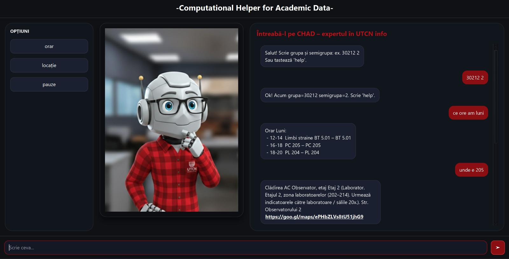

 CHAD – Student Assistant

In a world where AI seems capable of solving almost anything, this project focuses on a different kind of challenge — the small, contextual problems that students face every day and that are often overlooked.

CHAD was built around a simple idea:
**What if a rule-based assistant could truly understand the real needs of a university student?**

📌 About the Project

CHAD is a desktop application developed in **Java (JavaFX)** that helps students navigate academic life at **UTCN** in a practical and immediate way.

Instead of relying on generic solutions, CHAD focuses on providing **clear, structured, and context-aware information** tailored to student needs.

 ⚙️ Features

The application can:

* 📍 Help students quickly find:

  * classrooms
  * the secretary’s office
  * the library
    → with detailed, location-specific guidance

* 📅 Display daily schedules instantly
  → e.g. *“What classes do I have on Monday?”*

* ⏱ Show break intervals between classes

* 🧭 Generate floor-specific directions
  → no more wandering through hallways

* 🌍 Generate direct Google Maps links for buildings

* 💬 Provide structured academic information through a conversational chat interface

 🚧 Project Status

⚠️ **This project is currently a work in progress.**
Some features are still under development and improvements are ongoing.

💡 Purpose

This project explores how a **rule-based system** can still be highly effective when applied to well-defined, real-world problems — especially in a university context.

🛠️ Technologies Used

* Java
* JavaFX
* JSON processing (for schedule data)

 📂 Structure

The project follows a standard Java/Maven structure:

* `src` – source code
* `pom.xml` – project configuration
* `.gitignore` – ignored files

 📎 Notes

This project is being actively developed and improved. Feedback and suggestions are welcome.
